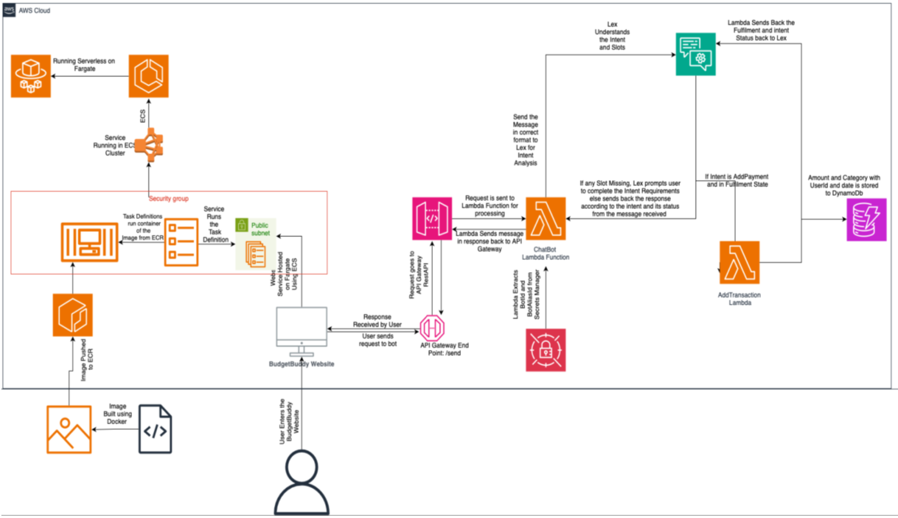

# BudgetBuddy

In a world where managing money wisely is crucial, BudgetBuddy stands out as a helpful
guide. This innovative chatbot, powered by AWS Lex and supported by other AWS services,
simplifies financial management. BudgetBuddy makes it easy for users to track expenses, set
budgets. By using AWS Lambda, API Gateway, ECS, ECR, Fargate, DynamoDB, and Secrets
Manager, BudgetBuddy ensures a secure and scalable solution. With BudgetBuddy, managing
finances becomes straightforward and empowering, helping users make informed decisions to
reach their financial goals. Overall, BudgetBuddy helps in overall personal finance and
budgeting in form a chatbot making it easier for users to enter their transactions and store them
securely.

## Services Used

* Compute:
    *   AWS Lambda
    *   AWS Elastic Container Registry and Elastic Container Service Along with Fargate
* Storage:
    * DynamoDB
* Networking:
    * API Gateway
* General:
    * AWS Lex
    * Secrets Manager

# Deployment Model (Public Cloud)
For the BudgetBuddy personal finance application, I opted for a public cloud deployment
model, specifically leveraging the infrastructure provided by Amazon Web Services (AWS).
The public cloud is defined as computing services offered by third-party providers over the
public Internet, making them available to anyone who wants to use or purchase them

# Delivery Model Function as a Service (FaaS) and Platform as a Service (PaaS)
BudgetBuddy adopts a delivery model that combines the strengths of Function as a Service
(FaaS) and Platform as a Service (PaaS) to provide a comprehensive personal finance solution.
The application leverages AWS Lambda for its backend operations, utilizing the FaaS model
for efficient, event-driven execution of code without the need to manage servers. This ensures
scalability and cost-effectiveness, as the application automatically scales to meet user demand,
optimizing resource utilization and reducing operational overhead.
In addition to FaaS, BudgetBuddy utilizes PaaS offerings for additional infrastructure needs,
further enhancing its scalability and efficiency. This hybrid approach not only provides a user-
friendly platform for managing finances but also improves operational efficiency, making
BudgetBuddy a robust and efficient personal finance application.

# Cloud Mechanisms
This system architecture utilizes AWS services and leverages its power alongside the
scalability of AWS Cloud helping users experience overall a seamless experience with minimal
downtime and faster processing times. The cloud mechanisms working together to makes this
architecture possible and help users for a smooth experience are:
* AWS ECS-Fargate: Runs the frontend end service by fetching the pre-built image
from the ECR and creates a Fargate backed service according to the task definition on
the ECS Cluster.
* AWS Lambda: Executes serverless function for text processing for the user input and
sending it to the Lex for Natural Language Processing(NLP). The second lambda helps
in processing the intent of the final Fulfilment Status “Fulfilled”. And then sends the
amount and category to the DynamoDB. Lambda function helps in auto-scaling based
on request volume.
* AWS API-Gateway: It is the entry point of the application which send user request
securely to the lambda function for further processing. It is CORS enabled which helps
in sending the request from the user’s browser to AWS. It sends HTTP requests over
the REST API endpoint (“/send” in this case).
* Amazon DynamoDB: Stores the user transactions with the identified category and
amount along with the userId and the date. All though the application is currently single
user. Having userId help me easily scale to multi-user application. Using NoSQL gave
me the freedom from the rigid structured databases types which aligns better with my
application.
* AWS Lex: This service help in the building the main logic for the Chatbot alongside
enabling the NLP abilities by creating various intents and Slot elicitations. Identifies
the intent of the user message and responds according to it.
* AWS Secrets Manager: Helps in storing the bot and bot-alias id securely in this so that
the lambda function can easily extract it for calling the recognize_text() function to call
lex.
* IAM: Using the free tier account has enabled me to be careful of IAM roles and policies
and I have given proper access controls to the services and functions following the least
privilege principle.

# Programming Languages

* Technologies Used:
   * ReactJS [Frontend]
   * Docker [Containerizing the Application]
   * Python [Lambda Functions]
   * Shell Script [For enabling run time configuration for ECS Service]

# Future Development

If development were to continue on BudgetBuddy. Here are some potential additions I would
make to the application to make it more user friendly:
- Enhanced Reporting: I would implement more robust reporting features to provide users
with detailed insights into their spending habits, including customizable reports and
charts. This could be achieved using cloud-based analytics tools like Amazon QuickSight.
- Expense Tracking Enhancements: Adding features to make expense tracking more
intuitive and efficient, such as the ability to upload receipts, set recurring expenses, and
categorize expenses automatically. This could involve leveraging cloud storage services
for receipt storage and serverless computing for automated categorization.
- Localization and Currency Support: Adding support for multiple currencies and
localization to make the application more accessible to users in different regions. Cloud-
based localization services could be used for this purpose.
- Enhanced Security Measures: Continuing to improve security measures by
implementing features such as continuous security monitoring, regular security audits,
and enhancements to data encryption practices. Cloud providers offer various security
services, such as AWS Security Hub.